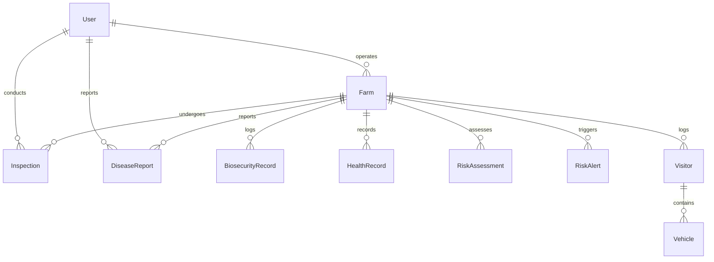

# Database Schema & Entity Relationships

This document details the relational entity structures defined inside the project schema.

## Entity Schema Outline

The database models are designed to map the complete biosecurity lifecycle from farm registry to veterinary outbreak resolution.

### Core Entities & Descriptions

1. **User**: Represents farmers, veterinary officers, and state directors. Managed in production using next-auth configurations.
2. **Farm**: Core geographic node with latitude and longitude coordinates. Bounded to a single farmer user.
3. **BiosecurityRecord**: Daily checks logging disinfection, PPE usage, and footbath status. Computes compliance scores.
4. **HealthRecord**: Daily tracking logging sickness, mortality, and symptoms.
5. **RiskAssessment**: Engine-computed risk scores based on mortality anomalies and compliance logs.
6. **RiskAlert**: Critical and High severity warnings generated from assessments. Dispatches alert banners and SMS hooks.
7. **Visitor & Vehicle**: Gate entry and exit registry containing plate license numbers and disinfection statuses.
8. **DiseaseReport**: Outbreak warnings flagged directly by farmers. Supports photo attachments and voice record URLs.
9. **Inspection**: Veterinary field notes scheduling, sample collections, and quarantine actions.
